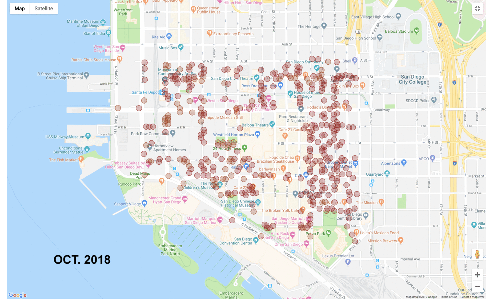

## CityIQ Access
CityIQ Access is a package that allows you to access smart street sensors (to track traffic, pedestrian, temperature, humidity, pressure, and more) installed by Current (powered by GE). Check to make sure if your city has these sensors installed at [https://developer.currentbyge.com/cityiq](https://developer.currentbyge.com/cityiq)

## Setting Up

### 1. Setting up the env variables
Make a `.env` file with following:

```
CLIENTID=InsertYourClientIDhere
ClIENTSECRET=InsertClientSecret
google_api_key=InsertYourGoogleMapAPIHere

```
CLIENTID and ClIENTSECRET can be found on your city's page or by emailing CityIQ's representatives. For San Diego, use this [link](https://www.sandiego.gov/sustainability/energy-and-water-efficiency/programs-projects/smart-city).

You can sign up to have a free Google's Geocoding API (with limited request) [here](https://developers.google.com/maps/documentation/geocoding/start).

### 2. Update the `constants.py` file
If your city is other than San Diego, make sure to change the variables inside the `constants.py` file with your's city urls and zones. 


## Getting Started


### Accessing Environment Data

```python
from cityiqaccess import cityiq

sandiego = cityiq.CityIQ()

# E street between 7th and 8th Ave (San Diego Downtown)
bbox = '32.714858:-117.158431,32.714562:-117.157248' 

# JSON formated dictionary
temperature_data = sandiego.get_temperature_metadata_by_bbox(bbox)
```

NOTE: There are more ways to derive temperature other than bbox, check the documentation for more information.

### Accessing Parking Data

```python
from cityiqaccess import cityiq

sandiego = cityiq.CityIQ()

# E street between 7th and 8th Ave (San Diego Downtown)
bbox = '32.714858:-117.158431,32.714562:-117.157248' 
start_time = 1557187235000
end_time = 1557190835000

# JSON formated dictionary
open_spots = get_open_parking_spots_by_bbox(start_time, end_time, bbox)

```
NOTE: There are more ways to derive open/occupied parking data other than bbox, check the documentation for more information.


## Examples

### San Diego Downtown Temperature (Oct. 2018 - May 2019)



